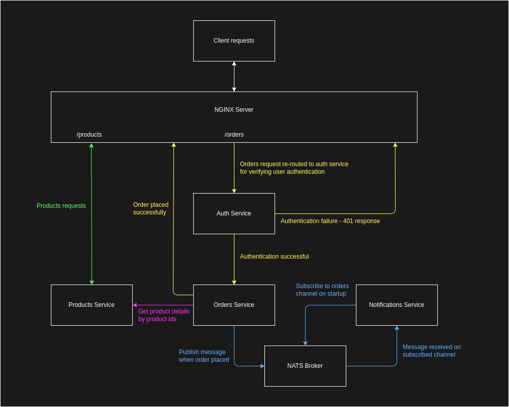

# Hello there :wave:

This is a simple ecommerce application backend built using the microservices architecture.

## Application Design

## Technologies & Tools Used
- [Node.js](https://nodejs.org/)
- [Python](https://www.python.org/)
- [Docker](https://www.docker.com/) & [docker-compose](https://docs.docker.com/compose/)
- [Nginx](https://www.nginx.com/)
- [Nats](https://github.com/nats-io/nats.js)
